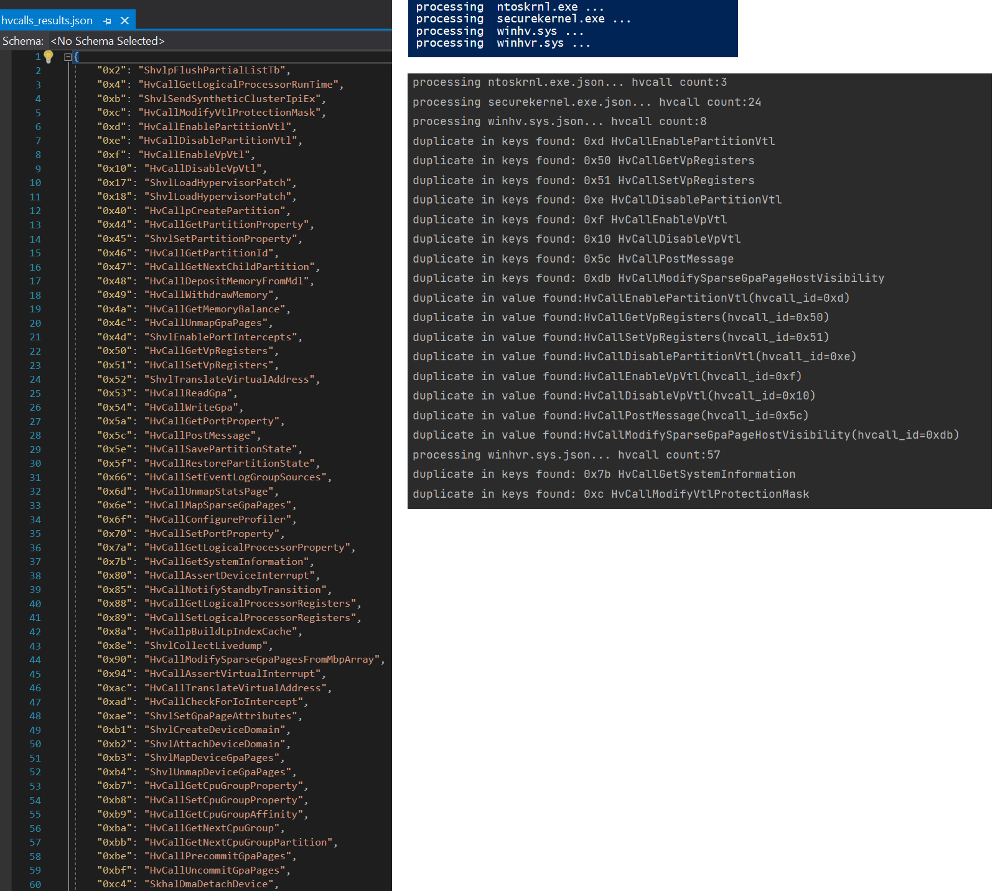

extract_hvcalls.py - script based on IDA-python (from IDA PRO 7.5) for automatically extraction of Hyper-V hypercalls codes and names from different Windows binaries:

	securekernel.exe
	winhvr.sys
	winhv.sys
	ntoskrnl.exe
	
additionally can be added
 
	securekernella57.exe
	ntkrla57.exe

1. Download idahunt plugin (https://github.com/nccgroup/idahunt) and place it in extract_hvcalls.py script directory (or change path to plugin in script) - idahunt can be used in some cases for disassembling binaries. Default extract_hvcalls.py mode is decompiling, that doesn't require idahunt
2. Change path to IDA PRO and binaries directory in start.ps1 script
3. Run start.ps1 script. It runs multiple instances of IDA PRO for Windows binaries analysis 
4. Run hvcalls_merge.py after analysis will be finished (some duplicates in hypercalls can be found)
5. You can see resulting json files inside "result" directory:
	hvcalls_results.json - list of Hyper-V hypercalls
	hvcalls_unknown.json - list of hypercalls name with unknown Hypercall code (you need do manual analysis for it)
	
I recommend extract hypercalls from winhvr.sys and winhv.sys first, then from other files.
	
